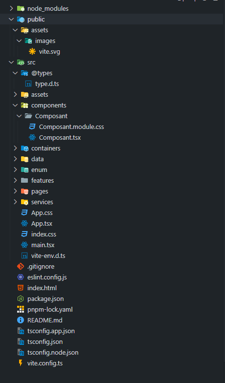

# Cheatsheet 

## Gestionnaire de package

| Nom du gestionnaire | Avantages | Inconvénients |
| ----------- | ----------- | ----------- |
| npm | Intégré à NodeJS <br> Compatible avec tous les paquets JS <br> Communauté <br> Simplicité d'usage | Vitesse <br> Gestion des dépendances <br> Poids des installations |
| pnpm | Vitesse <br> Espace disque réduit <br> Intégration facile avec npm <br> isolation des dépendances | Moins répandu <br> Compatibilité | 
| Yarn | Vitesse <br> Fiabilité <br> Installation parallèle <br> Plug'n'Play | Poids des installations <br> Différence avec npm <br> Mise à jour moins fréquentes| 

### Installer/Activer pnpm

````
 npm i pnpm
````

## React

<!--  TODO Explication de vite (bundler qui compile) !-->
### Créer un projet avec vite

````
 pnpm create vite@latest
````
Plusieurs questions vont être posées
  1. Le nom du projet ("." pour le répertoire courant)
  2. Choix de la bibliothèque / du framework
  3. Choix Javascript ou typescript (+ SWC)

Ensuite se rendre dans le dossier ou l'installation à été faite

````
pnpm install
````

Cette commande permet de télécharger les dépendances spécifiées dans le packages.json (node_modules)
Si un projet est récuépérer depuis un github, le node_module est dans le .gitignore et n'est pas récupérer, il est donc nécessaire de faire cette commande pour télécharger les dépendances.

### Lancer un projet en local

````
pnpm run dev
````
Par défault, le projet sera héberger sur le "http://localhost:5173/"

### Structure d'un projet


### Les Hooks

#### useEffect

Le useEffect est du code qui sera éxécuté soit, au premier rendu du composant, soit à chaque rendu soit à chaque modification de la variable passé en paramètre du useEffect.

Dans ce cas-ci, l'affichage dans la console sera effectué uniquement au premier rendu du composant.

```
  useEffect(() => {
    console.log("Effectué une seule fois");
    return () => {};
  }, []);
```

Dans ce cas-ci, l'affichage dans la console sera effectué à chaque rendu du composant.

```
  useEffect(() => {
    console.log("Effectué à chaque rendu");
    return () => {};
  });
```

Dans ce cas-ci, l'affichage dans la console sera effectué à chaque modification de la variable "Value".

Attention au boucle infinie si du code dans ce useEffect met à jour la variable impliquée.
```
  useEffect(() => {
    console.log("Effectué à chaque changement de la variable");
    return () => {};
  }, [value]);
```

#### useState

Le useState est un hook utilisé pour ajouter un état local aux composants.
Il retourne une paire [valeur, fonctionDeMiseAJour]  

```
  const [value, setValue] = useState<number>(0);
```

Il est important de noté que la fonction de mise à jour (setState) ne remplace par l'état immédiatement et que c'est une opération asynchrone. L'appel à au setState, planifie une mise à jour du composant et la valeur ne sera mise à jour qu'au rendu de celui ci.

Exemple ce code affichera 1 et non 2 car la valeur n'as pas encore été mise à jour.
```
      const [value, setValue] = useState<number>(0);

      setValue((prevValue) => prevValue + 1);
      setValue((prevValue) => prevValue + 1);
```

#### useRef

Ce hook permet de créer une référence mutable qui peut persister entre les rendu sans déclencher de render lorsqu'elle est modifiée. 
Elle est utile pour accéder à des élements du DOM directement.
```
function TextInputWithFocusButton() {
  const inputRef = useRef(null);

  const focusInput = () => {
    // Accède à l'élément DOM via inputRef.current et applique le focus
    inputRef.current.focus();
  };

  return (
    <div>
      <input ref={inputRef} type="text" />
      <button onClick={focusInput}>Focus sur l'input</button>
    </div>
  );
}
```

Ou pour stocker des valeurs persistance.
```
function Counter() {
  const [count, setCount] = useState(0);
  const renderCount = useRef(1);

  useEffect(() => {
    renderCount.current += 1;
  });

  return (
    <div>
      <p>Le compteur est à : {count}</p>
      <p>Le composant a été rendu {renderCount.current} fois</p>
      <button onClick={() => setCount(count + 1)}>Incrémenter</button>
    </div>
  );
}
```

### useId
Ce hook permet de générer des identifiants unique qui peuvent être utilisé dans les composants, particulièrement utile pour créer les attributs id qui sont unique dans le DOM.
```
function MyForm() {
  const id = useId();

  return (
    <div>
      <label htmlFor={`${id}-name`}>Nom :</label>
      <input id={`${id}-name`} type="text" />
    </div>
  );
}
```

### Le Typage

```
type User = {
  id?: number;
  name: string;
  firstname: string;
  adress: adress;
};

type Adress = {
  street: string;
  postalCode: number;
  houseNumber: number;
};
```
Le "?" dans le typage signifique c'est une valeur qui n'est pas obligatoire.

### Les Enumération

```
export enum Nat {
  BE = "BE",
  FR = "FR",
  IT = "IT",
  UK = "UK",
}

export enum Statut {
  InProgress = 1,
  Closed,
  ReOpen,
}
```

Dans le cas du statut, cette syntaxe signifique que Closed vaudra 2 et que ReOpen vaudra 3 et ainsi de suite.

### Passage de props 

#### Passage par object

```
import { ComposantEnfant } from "../ComposantEnfant/ComposantEnfant";

export const ComposantParent = () => {
  const adressUser = {
    street: "Avenue Jean Mermoz, 28",
    postalCode: "6040",
  };
  return <ComposantEnfant adress={adressUser}></ComposantEnfant>;
};
```
```
type ComposantEnfantProps = {
  adress: {
    street: string;
    postalCode: string;
  };
};
export const ComposantEnfant = ({ adress }: ComposantEnfantProps) => {
  return (
    <div>
      <div>
        <p>Rue: {adress.street}</p>
        <p>Code postal: {adress.postalCode}</p>
      </div>
    </div>
  );
};

```
#### Passage direct

```
import { ComposantEnfant } from "../ComposantEnfant/ComposantEnfant";

export const ComposantParent = () => {
  const user = {
    name: "john",
    email: "john@doe.com",
  };
  return <ComposantEnfant {...user}></ComposantEnfant>;
};
```

```
type ComposantEnfantProps = {
  name: string;
  email: string;
};
export const ComposantEnfant = (user: ComposantEnfantProps) => {
  return (
    <div>
      <div>
        <p>Nom: {user.name}</p>
        <p>Email: {user.email}</p>
      </div>
    </div>
  );
};


```
### Routing avec react router
<!-- TODO !-->

### Formulaire avec React-Hook-Form

Exemple d'un formulaire basique de login.
```
import { useForm } from "react-hook-form";

type LoginProps = {
  email: string;
  password: string;
};

export const FormComponent = () => {
  const {
    register,
    handleSubmit,
    reset,
    formState: { errors },
  } = useForm<LoginProps>({
    defaultValues: {
      email: "",
      password: "",
    },
  });

  const onSubmitLogin = (data: LoginProps) => {
    // les données du formulaires se trouvent dans data
    console.log(data.email);
    reset();
  };

  return (
    <>
      <form onSubmit={handleSubmit(onSubmitLogin)}>
        <div>
          <label>Email : </label>
          <input type="text" {...register("email", { required: true })} />
          {errors.email && <p>Veuillez indiquez une adresse email.</p>}
        </div>
        <div>
          <label>Password : </label>
          <input
            type="password"
            {...register("password", { min: 1, required: true })}
          />
          {errors.email && <p>Veuillez indiquez un mot de passe.</p>}
        </div>

        <div>
          <button type="submit">Login</button>
        </div>
      </form>
    </>
  );
};
```

### Validation d'un formulaire React-Hook-Form avec Yup

Afin de valider les données d'un formulaire, il est possible de passer par une bibliothèque comme Yup. Celle-ci permet d'établir un schéma avec les définitions des obligations des champs du formulaire.
Exemple de code
```
import { yupResolver } from "@hookform/resolvers/yup";
import { useForm } from "react-hook-form";
import * as Yup from "yup";

type LoginProps = {
  email: string;
  password: string;
};

//Définition du schéma de validation
const validationSchema = Yup.object().shape({
  email: Yup.string()
    .email("L'adresse email n'est pas valide")
    .required("L'adresse email est requise."),
  password: Yup.string().required("Le mot de passe."),
});

export const FormComponent = () => {
  const {
    register,
    handleSubmit,
    reset,
    formState: { errors },
  } = useForm<LoginProps>({
    defaultValues: {
      email: "",
      password: "",
    },
    resolver: yupResolver(validationSchema),
  });

  const onSubmitLogin = (data: LoginProps) => {
    // les données du formulaires se trouvent dans data
    console.log(data.email);
    reset();
  };

  return (
    <>
      <form onSubmit={handleSubmit(onSubmitLogin)}>
        <div>
          <label>Email : </label>
          <input type="text" {...register("email", { required: true })} />
          {errors.email && <p>{errors.email.message}</p>}
        </div>
        <div>
          <label>Password : </label>
          <input
            type="password"
            {...register("password", { min: 1, required: true })}
          />
          {errors.email && <p>Veuillez indiquez un mot de passe.</p>}
        </div>

        <div>
          <button type="submit">Login</button>
        </div>
      </form>
    </>
  );
};

```
### Requête HTTP avec Axios

Exemple de code pour un get avec Axios.
```
import axios from "axios";
import { useEffect, useState } from "react";

type catFactFromEndpoint = {
  status: Status;
  _id: string;
  user: string;
  text: string;
  __v: number;
  source: string;
  updatedAt: string;
  type: string;
  createdAt: string;
  deleted: boolean;
  used: boolean;
};

type Status = {
  verified: boolean;
  sentCount: number;
};

type catFact = Pick<catFactFromEndpoint, "text">;

export const AxiosComponent = () => {
  const endpoint: string = "https://cat-fact.herokuapp.com";

  const [dataCatFact, setDataCatFact] = useState<catFact>();
  const [errorFetch, setErrorFetch] = useState<string>("");
  const [isLoading, setIsLoading] = useState<boolean>(false);

  const fetchCatFact = async () => {
    setErrorFetch("");
    setIsLoading(true);
    setDataCatFact({
      text: "",
    });
    try {
      const response = await axios.get(endpoint + "/facts/random");
      setDataCatFact(response.data); // Mettre à jour l'état avec la donnée reçue
    } catch (err) {
      // Gérer les erreurs
      if (err) {
        setErrorFetch(err.toString());
      } else {
        setErrorFetch("Erreur lors du chargement des faits sur les chats");
      }
      
    } finally {
      // La requête est terminée, on enlève le chargement
      setIsLoading(false); 
    }
  };

  useEffect(() => {
    fetchCatFact();
  }, []);

  return (
    <div>
      {isLoading && <p>Chargement en cours</p>}
      {dataCatFact && <p> {dataCatFact?.text} </p>}
      {errorFetch && <p> {errorFetch} </p>}
      <button onClick={fetchCatFact}>Send request</button>
    </div>
  );
};
```
### Redux

Example de code: Application affichant des "Cat fact" qui viennent d'une API.
Création du store dans l'application. Avec redux, celui-ci doit être unique et ne sera fait qu'une seule fois. il sera cependant modifié pour rajouter les nouveaux reducer.
```
//Fichier store.ts
import { configureStore } from "@reduxjs/toolkit";
import catFactReducer from "./catFact/catFact.reducer";

const store = configureStore({
  reducer: {
    catFact: catFactReducer,
  },
  devTools: import.meta.env.DEV,
});

// - Le type du store Redux
export type Store = typeof store;
// - Le type du "state" du store (via la méthode "getState")
export type StateStore = ReturnType<Store["getState"]>;
// - Le type des actions possible du store (via le dispatcher)
export type DispatchStore = Store["dispatch"];

export default store;
```
Création des actions et du reducer
```
//Fichier catFact.action.ts
import { createAsyncThunk } from "@reduxjs/toolkit";
import { requestNewCatFact } from "../../services/catFact.service";

type CatFactData = {
  text: string;
};

export const getCatFact = createAsyncThunk("catFact/getCatFact", async () => {
  // Requete ajax
  const data: CatFactData = await requestNewCatFact();

  // En cas de succes -> Envoi des données
  return data;
});
```
```
//Fichier catFact.reducer.ts
import { createReducer } from "@reduxjs/toolkit";
import { getCatFact } from "./catFact.action";

export type CatFact = {
  text: string;
};
export type catFactReducerState = {
  catFacts: CatFact[];
  isLoading: boolean;
  error: string | null;
};

const initialState: catFactReducerState = {
  catFacts: [],
  isLoading: false,
  error: null,
};

const catFactReducer = createReducer(initialState, (builder) => {
  builder
    .addCase(getCatFact.pending, (state) => {
      state.isLoading = true;
      state.error = null;
    })
    .addCase(getCatFact.fulfilled, (state, action) => {
      const catFact = action.payload;
      state.isLoading = false;
      state.catFacts.push(catFact);
    })
    .addCase(getCatFact.rejected, (state, action) => {
      state.isLoading = false;
      state.error = action.error.message ?? "Erreur inconnue";
    });
});

export default catFactReducer;
```
Création du service permettant de récupérer via Axios les données d'une API (ici un simple GET afin de récupérer un "cat fact")
```
//Fichier catFact.services.ts
import axios from "axios";

export const requestNewCatFact = async () => {
  const endpoint: string = "https://cat-fact.herokuapp.com";

  const { data } = await axios.get(endpoint + "/facts/random");

  return {
    text: data.text,
  };
};
```
Englober l'application dans le store afin quce celui-ci soit disponible partout.
```
//Fichier main.tsx
import { StrictMode } from "react";
import { createRoot } from "react-dom/client";
import { Provider } from "react-redux";
import App from "./App.tsx";
import "./index.css";
import store from "./store/store.ts";

createRoot(document.getElementById("root")!).render(
  <StrictMode>
    <Provider store={store}>
      <App />
    </Provider>
  </StrictMode>
);
```
Utilisation de redux dans un composant afin de récupérer et d'affichers des catfacts.
Dans cet exemple, division en 3 composants : 
 - CatFactComponent: composant principale qui fait appel au dispatch et au store. C'est ce composants qui contient la listes des catFact ainsi que le button qui fait les appels à l'API pour récupérer des catfacts.
 - CatFactComponentList : Composant qui affiches CatFactComponentItem. Son parent lui a passer la liste des Catfacts. Il les passera ensuite un part un à son enfant CatFactComponentListItem.
 - CatFactComponentListItem : Composant qui se charge uniquement d'afficher le catFact. Son parent CatFactComponentList lui à uniquement passer le Catfact qu'il doit afficher
```
//Fichier CatFactComponent.tsx
import { useDispatch, useSelector } from "react-redux";
import { getCatFact } from "../../store/catFact/catFact.action";
import { DispatchStore, StateStore } from "../../store/store";
import { CatFactComponentList } from "./CatFactComponentList";

export const CatFactComponent = () => {
  const dispatch: DispatchStore = useDispatch();

  const catFacts = useSelector((state: StateStore) => state.catFact.catFacts);

  const handleGetNewCatFact = () => {
    dispatch(getCatFact());
  };

  return (
    <section>
      <div>
        <button onClick={handleGetNewCatFact}>
          Recupérer un nouveau catFact
        </button>
      </div>
      <div>
        <CatFactComponentList catFacts={catFacts}></CatFactComponentList>
      </div>
    </section>
  );
};
```
```
//Fichier CatFactComponentList
import { CatFact } from "../../store/catFact/catFact.reducer";
import { CatFactComponentListItem } from "./CatFactComponentListItem";

export type CatFactComponentListProps = {
  catFacts: CatFact[];
};

export const CatFactComponentList = ({
  catFacts,
}: CatFactComponentListProps) => {
  return (
    <section>
      {catFacts.map((catFact) => (
        <CatFactComponentListItem {...catFact} />
      ))}
    </section>
  );
};
```
```
//Fichier CatFactComponentListItem
import { CatFact } from "../../store/catFact/catFact.reducer";

export type CatFactComponentListItemProps = CatFact & {};

export const CatFactComponentListItem = ({
  text,
}: CatFactComponentListItemProps) => {
  return (
    <article>
      <p>CatFact : {text}</p>
    </article>
  );
};
```

### Extension utile VSCode 
- Better comments
- CodeSnap
- Color Highlight
- Auto Rename Tag
- Error Lens
- ES7 + React/Redux/React-native snippets
- ESLint
- gitignore
- GitLens
- indent-rainbow
- Javascript (ES6) code snippets
- Path intellisense
- Prettier
- Prettier ESLint
- Pretty TypeScript errors
- SVG
- Tailwind CSS IntelliSense
- Thunder Client
- VSCode React Refactor
  
### Raccourcis utile VSCode

 - **Recherche** : `Ctrl + Shift + F`
 - **Formater le code** : `Alt + Shift + F`
 - **Sélectionner la prochaine paire d'accolades** : `Ctrl + Shift + ]`
 - **Rechercher et remplacer dans le fichier** : `Ctrl + H`
 - **Ouvrir le terminal** : `Ctrl + Shift + ù`
 - **Rechercher dans le fichier** : `Ctrl + F`
 - **Mettre en commentaire la sélection : `Ctrl + :`
 - **Aller à la définition** : `F12`
 - **Afficher des suggestions de code** : `Ctrl + espace`
 - **Indentation automatique** : `Ctrl + Shift + I`
 - **Déplacer la ligne vers la bas/haut** : `Alt +  ↓ / ↑`
 - **Copier la ligne vers le bas/haut** : `Alt + Shift + ↓ / ↑`
 - **Changer le nom de la variable partout dans le fichier** : `F2`
 - **Sélection multiple de curseurs** + : `Ctrl + D`
 - **Ouvrir le panneau de commande** : `Ctrl + Shift + P`
 - **Supprimer la ligne** : `Ctrl + Shift + K`

### Bibliothèque 

  - i18n
  - Material UI / Shadcn
  - Yup
  - React-Hook-Form
  - SWR
  - Axios
  - json-server
  - Redux
  - React-router

### Extension navigateur

  -  Redux DevTools
  -  React Developper Tools
    
## Documentation / Lien utile

### Utilitaire

  - [I Hate Regex](https://ihateregex.io/)
  - [npm](https://www.npmjs.com/)
    
### Jeux/Apprentissage

  - [CssBattle](https://cssbattle.dev/)
  - [CodingFantasy](https://codingfantasy.com/)
  - [FlexboxDefense](http://www.flexboxdefense.com/)
  - [ICodeThis](https://icodethis.com/app)
  - [FlexboxFroggy](https://flexboxfroggy.com/)

### Bibliothèque

  - [i18n](https://www.i18next.com/)
  - [React-Hook-Form](https://www.react-hook-form.com/)
  - [Material UI](https://mui.com/material-ui/getting-started/)
  - [Yup](https://mui.com/material-ui/getting-started/)
  - [Axios](https://axios-http.com/docs/intro)
  - [SWR](https://swr.vercel.app/)
  - [Redux](https://redux.js.org/)
  - [React-router](https://reactrouter.com/en/main)

### Interface

  - [Uiball](https://uiball.com/ldrs/)

    <!-- repos avec projet et code pour chaque point (react router, hook, etc...    !-->

  
